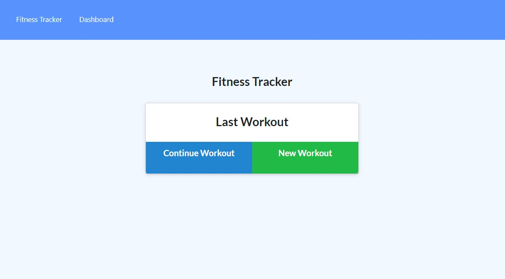

# Workout Tracker

## Description:

---
Workout Tracker app to keep track of my daily workout routine and help with my attempts to live healthier!

## [Workout Tracker FM](https://workout-tracker-fm.herokuapp.com/)
### https://github.com/Myuze/workout-tracker-fm
---

## Table of Contents:

---
1. [Installation Instructions](#installation-instructions)
2. [Usage](#usage)
3. [Contribute](#contribute)
4. [Licenses](#licenses)
5. [Questions](#questions)

## Installation Instructions:

---
1. Install, `node.js`.
2. Clone the application repository.
3. In the repository root, in the CLI, `npm install`.

## Usage:

---
From the repository directory:
1. From the CLI use, `npm start`.
2. Seed DB, `npm run seed`.
3. Open the page at `localhost:3000`.

## Contribute:

---
- If you would like to contribute you can contact me on Github or by Email.

## Licenses:

---

**MIT License**
Copyright &#169; 2021

## Questions:

---

### What is your Github username?

[Myuze](https://github.com/Myuze)

### If you have any other questions, you can reach me at:

[flmeneses.dev@gmail.com](mailto:flmeneses.dev@gmail.com)
